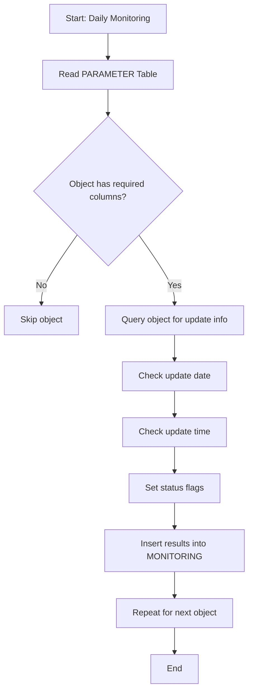

%md
# Database Update Monitoring: Documentation & Workflow

---

## Introduction & Purpose
This documentation provides a comprehensive overview of the database update monitoring solution, designed for developers, data analysts, DBAs, and business users. It explains how the system tracks, validates, and reports on database update routines and frequency, supporting reliable dashboards and decision-making.

---

## Table Definitions
### MONITORING Table
Records the status and details of database updates for each monitored object. Enables tracking of data freshness and reliability.
* NU_SESSION: Session update number
* DT_INSERT: Date of insert
* DT_LAST_UPDATE: Date of last update
* SCHEMA_NAME: Schema name
* OBJECT_NAME: Object name
* FREQUENCY_TYPE: Update frequency
* ACTUAL_DATE: Date update validated
* ESTIMATED_TIME: Scheduled start time
* LIMIT_TIME: Deadline for update
* FINISH_TIME: Actual update time
* DATA_VOLUME: Number of rows updated
* UP_DATE_CHECK: Status for update day
* UP_HOUR_CHECK: Status for update time
* RESULT_UPDATE: Overall result

### PARAMETER Table
Stores default update rules for each monitored object.
* SCHEMA_NAME: Schema name
* OBJECT_NAME: Object name
* OBJECT_TYPE: Type (TABLE/VIEW)
* FREQUENCY_TYPE: Update frequency
* UPDATE_TIME: Scheduled update time
* UPDATE_TYPE: Update rule

---

## Procedure Logic & Workflow
### Overview
The `PRC_MONITORING` procedure automates monitoring, ensuring updates happen on time and according to business rules.

### Step-by-Step Workflow
1. Identify objects to monitor (from PARAMETER table)
2. Validate required columns
3. Gather update information
4. Status checks (date/time)
5. Record results in MONITORING table
6. (Optional) Data retention

### Key Variables
* v_query: Dynamic SQL for update info
* myrecord: Stores query results
* Status flags: Indicate update health

---

## Workflow Diagrams & Process Summary
### Visual Workflow

### Process Summary
* Runs daily, checking all configured objects
* Validates updates and records results
* Powers dashboards and alerts for data reliability

---

## Business Value & Audience Benefits
### For Developers
* Simplifies integration into ETL/data pipelines
* Reusable procedures and tables

### For Data Analysts
* Ensures up-to-date data for analytics
* Quick identification of late/missing updates

### For DBAs
* Centralized monitoring across schemas
* Supports compliance and audit

### For Business Users
* Transparent, easy-to-understand dashboards
* Builds trust in data reliability

### Overall Value
* Reduces manual effort and risk
* Enables proactive management of data freshness
* Supports business continuity and operational excellence
