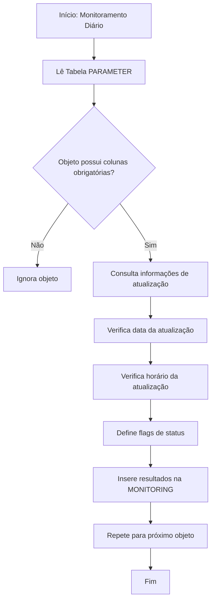

# Monitoramento de Atualizações de Banco de Dados: Documentação & Fluxo de Trabalho

---

## Introdução & Objetivo
Esta documentação apresenta uma visão detalhada da solução de monitoramento de atualizações de banco de dados, voltada para desenvolvedores, analistas de dados, DBAs e usuários de negócios. Explica como o sistema rastreia, valida e reporta rotinas e frequências de atualização, apoiando dashboards confiáveis e tomadas de decisão.

---

## Definição das Tabelas
### Tabela MONITORING
Registra o status e detalhes das atualizações de cada objeto monitorado. Permite o acompanhamento da atualidade e confiabilidade dos dados.
* NU_SESSION: Número da sessão de atualização
* DT_INSERT: Data de inserção
* DT_LAST_UPDATE: Data da última atualização
* SCHEMA_NAME: Nome do schema
* OBJECT_NAME: Nome do objeto
* FREQUENCY_TYPE: Frequência de atualização
* ACTUAL_DATE: Data de validação da atualização
* ESTIMATED_TIME: Horário previsto para início
* LIMIT_TIME: Prazo limite para atualização
* FINISH_TIME: Horário real da última atualização
* DATA_VOLUME: Quantidade de linhas atualizadas
* UP_DATE_CHECK: Status do dia da atualização
* UP_HOUR_CHECK: Status do horário da atualização
* RESULT_UPDATE: Resultado geral

### Tabela PARAMETER
Armazena regras padrão de atualização para cada objeto monitorado.
* SCHEMA_NAME: Nome do schema
* OBJECT_NAME: Nome do objeto
* OBJECT_TYPE: Tipo (TABELA/VISÃO)
* FREQUENCY_TYPE: Frequência de atualização
* UPDATE_TIME: Horário previsto para atualização
* UPDATE_TYPE: Regra de atualização

---

## Lógica do Procedimento & Fluxo de Trabalho
### Visão Geral
O procedimento `PRC_MONITORING` automatiza o monitoramento, garantindo que as atualizações ocorram no prazo e conforme as regras de negócio.

### Passo a Passo
1. Identifica objetos a serem monitorados (da tabela PARAMETER)
2. Valida colunas obrigatórias
3. Coleta informações da atualização
4. Verifica status (data/horário)
5. Registra resultados na tabela MONITORING
6. (Opcional) Retenção de dados

### Variáveis-Chave
* v_query: SQL dinâmico para buscar informações
* myrecord: Armazena resultados da consulta
* Flags de status: Indicam saúde da atualização

---

## Diagrama de Fluxo & Resumo do Processo
### Fluxo Visual

### Resumo do Processo
* Executa diariamente, verificando todos os objetos configurados
* Valida atualizações e registra resultados
* Alimenta dashboards e alertas para confiabilidade dos dados

---

## Valor de Negócio & Benefícios para o Público
### Para Desenvolvedores
* Facilita integração em pipelines ETL/dados
* Procedimentos e tabelas reutilizáveis

### Para Analistas de Dados
* Garante dados atualizados para análises
* Identificação rápida de atrasos ou falhas

### Para DBAs
* Monitoramento centralizado entre schemas
* Apoio à conformidade e auditoria

### Para Usuários de Negócio
* Dashboards transparentes e fáceis de entender
* Confiança na confiabilidade dos dados

### Valor Geral
* Reduz esforço manual e riscos
* Permite gestão proativa da atualidade dos dados
* Apoia continuidade operacional e excelência
