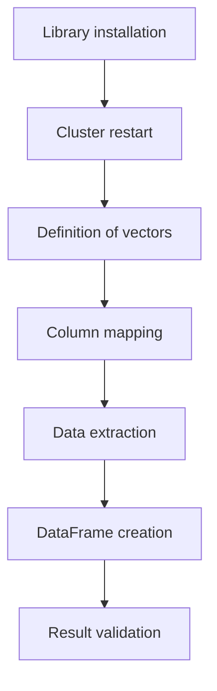
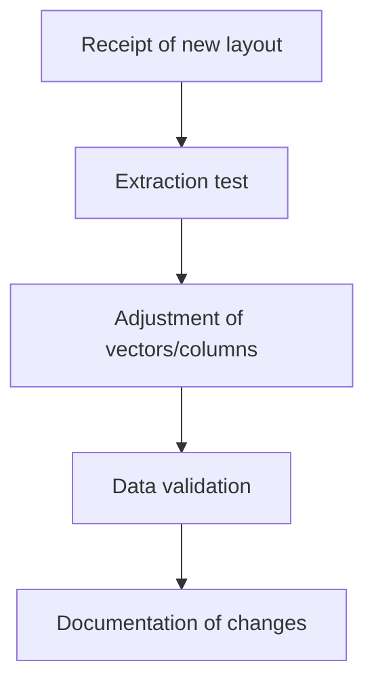
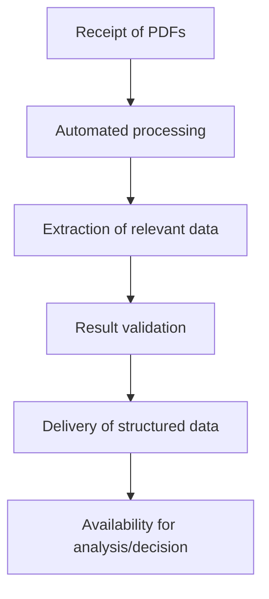

# PDF File Reader

## Overview
This notebook automates the extraction of data from PDF files, converting specific information into structured tables for analysis, integration, and process automation in Databricks environments. The project is designed to serve three main audiences: development team, maintenance staff, and management.

---

## 1. Development Team
### Technical Objective
Automate the extraction of data from standardized PDFs using coordinate vectors and the `pdfplumber` library, generating DataFrames ready for analysis, integration, or export.

### Technical Flowchart

### Critical Points
* Vectors must be adjusted according to the PDF layout.
* Columns must match the order of the vectors.
* Testing and validation are essential to ensure accuracy.

---

## 2. Maintenance and Continuity
### Guidelines
* Update vectors and column names if the PDF layout changes.
* Test extraction with different files to ensure consistency.
* Document all changes for traceability.
* Adapt exception handling for specific scenarios.

### Maintenance Flowchart

### Expansion
The notebook can be expanded to process multiple pages or different types of documents by adapting the extraction logic.

---

## 3. Management and Value Perception
### Strategic Benefits
* Agility in operational data analysis and integration.
* Improved traceability and process governance.
* Easier generation of strategic reports and insights.
* Cost reduction and mitigation of operational risks.

### Value Flowchart

### Business Impact
* Real-time managerial decision-making.
* Standardization of the data acquisition process.
* Scalability for different documents and business areas.
* Alignment between IT and strategic areas, accelerating digital transformation.

---

## Important Notes
* Ensure the PDF file path is correct and accessible in the environment.
* Adjust extraction areas according to the structure of the analyzed PDF document.
* Document all changes to ensure traceability and facilitate future adaptations.
