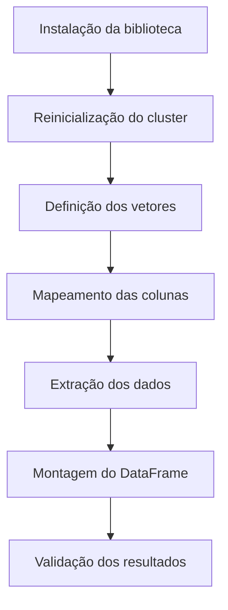
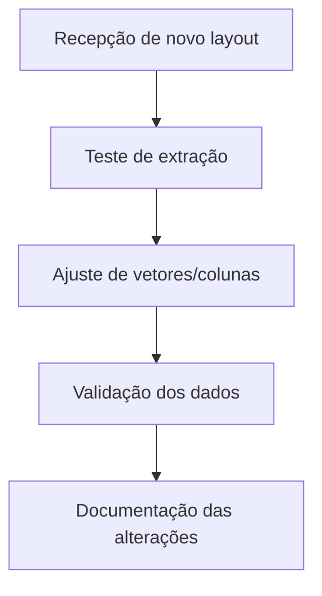
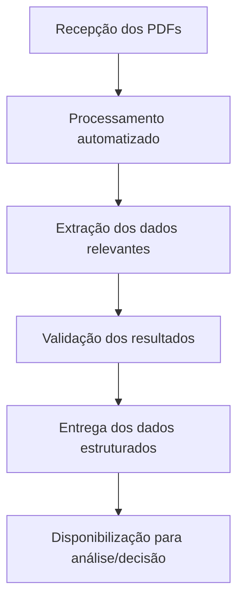

# Leitor de Arquivos PDF

## Visão Geral
Este notebook automatiza a extração de dados de arquivos PDF, convertendo informações específicas em tabelas estruturadas para análise, integração e automação de processos em ambientes Databricks.

---

- Arquivo PDF:

---
- Dados:

---

## 1. Processo de desenvolvimento
### Objetivo Técnico
Automatizar a extração de dados de PDFs padronizados usando vetores de coordenadas e a biblioteca `pdfplumber`, gerando DataFrames prontos para análise, integração ou exportação.

### Fluxograma Técnico

### Pontos Críticos
* Vetores devem ser ajustados conforme layout do PDF.
* Colunas precisam corresponder à ordem dos vetores.
* Testes e validação são essenciais para garantir precisão.

---

## 2. Manutenção e Evolução da utilização
### Orientações
* Atualize vetores e nomes das colunas se o layout dos PDFs mudar.
* Teste a extração com diferentes arquivos para garantir consistência.
* Documente todas as alterações para rastreabilidade.
* Adapte o tratamento de exceções conforme cenários específicos.

### Fluxograma de Manutenção

### Expansão
O notebook pode ser expandido para múltiplas páginas ou diferentes tipos de documentos, bastando adaptar a lógica de extração.

---

## 3. Resultados e valor
### Benefícios Estratégicos
* Agilidade na análise e integração dos dados operacionais.
* Melhoria da rastreabilidade e governança dos processos.
* Facilidade para gerar relatórios estratégicos e insights.
* Redução de custos e mitigação de riscos operacionais.

### Fluxograma de Valor

### Impacto no Negócio
* Decisões gerenciais em tempo real.
* Padronização do processo de obtenção de dados.
* Escalabilidade para diferentes documentos e áreas de negócio.
* Alinhamento entre TI e áreas estratégicas, acelerando a transformação digital.

---

## Observações Importantes
* Certifique-se de que o caminho do arquivo PDF está correto e acessível no ambiente.
* Ajuste as áreas de extração conforme a estrutura do documento PDF analisado.
* Documente todas as alterações realizadas para garantir rastreabilidade e facilitar futuras adaptações.
